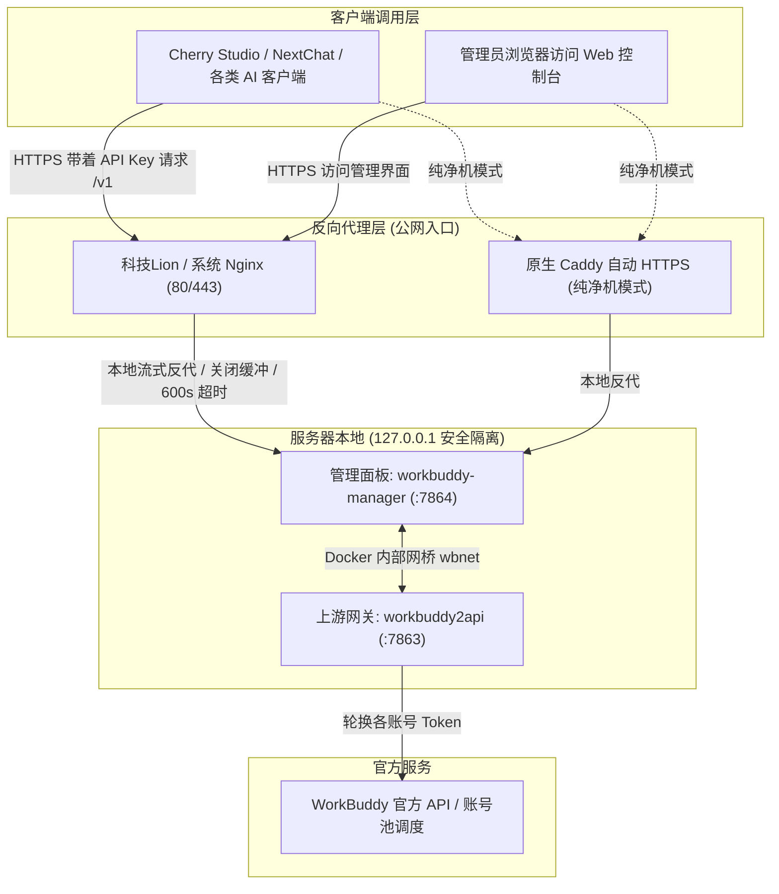

# 🚀 WorkBuddy 一键部署与反代增强版 (WorkBuddy2API + Manager)

> **一行命令在 Linux 服务器上快速部署 WorkBuddy 账号池网关与管理面板，完美兼顾 Nginx / 科技Lion (kejilion) 工具箱与原生 Caddy，零端口冲突，开箱即用。**

---

## 💡 为什么需要这个增强版本？

原版部署脚本在标准空机器上表现良好，但在真实运维环境中，绝大多数服务器已安装了 **Nginx / 科技Lion 工具箱 (kejilion.sh) / 宝塔 / 1Panel** 等建站环境，此时 80 和 443 端口已被独占。原脚本强行安装 Caddy 会直接引发严重的**端口冲突与服务崩溃**。

本**升级增强版**由实战场景驱动，重点攻克了**端口兼容、AI 流式输出（SSE）卡顿、API Key 自动化签发**等核心痛点：

### 🌟 核心升级亮点

| 痛点场景 | 原版表现 | 升级增强版表现 |
| :--- | :--- | :--- |
| **已有 Nginx / 科技Lion 80/443 占用** | 强行装 Caddy 导致端口冲突、服务报错崩溃 | **智能感知环境**：自动识别原生 Nginx 及 Docker 容器版 Nginx，跳过 Caddy，直接生成反代配置并热重载，**零冲突无缝共存** |
| **AI 逐字打字机（SSE）体验** | 反代缓冲未完全禁用，可能导致打字卡顿、突发吐字 | **SSE 深度强化**：禁用一切下游代理缓冲，开启 `X-Accel-Buffering no` 与 `chunked_transfer_encoding`，保障打字机流畅如丝 |
| **大模型深度思考长连接** | 默认超时较短，复杂长推理（如 o1 / r1）易 504 中断 | **600 秒长连接超时保障**，大文本生成与长时间任务稳定不掉线 |
| **外网 API 密钥自动签发** | 仅单次请求，小内存机器启动延迟易导致建 key 失败 | **增加 3 次智能退避重试**，确保护航自动生成 `MANAGER_API_KEY` 并写入凭据 |
| **宿主端口安全性** | 容易误暴露至公网 | 网关 (`7863`) 与面板 (`7864`) **强制仅绑定 `127.0.0.1`**，彻底隔离公网扫描风险 |

---

## 🏗️ 架构拓扑与运行流程



---

## ⚡ 极速开始：一条命令搞定

### 1. 全自动推荐部署（适合已有域名）
如果你的域名解析已指向服务器公网 IP：
```bash
curl -fsSL https://raw.githubusercontent.com/macsur/WorkBuddy/main/workbuddy-deploy.sh | sudo bash -s -- --domain workbuddy.example.com --auto
```

### 2. 交互式向导部署（推荐新手）
直接运行，脚本会友好提示输入域名、管理员密码等；直接回车即用自动计算的安全默认值：
```bash
bash workbuddy-deploy.sh
```

### 3. 纯本地私密部署（不分配外网域名）
如果不开放公网域名，仅通过内网或 SSH 隧道管理：
```bash
bash workbuddy-deploy.sh --auto
```

---

## 🖥️ 命令行参数与环境变量

脚本支持完整的无交互自动化调用，所有参数均可通过命令行或环境变量传入：

### 命令行选项
| 参数 | 简写 | 默认值 | 作用说明 |
| :--- | :---: | :---: | :--- |
| `--domain <域名>` | `-d` | *留空* | 面板与对外访问的主域名（如 `workbuddy.example.com`） |
| `--api-domain <域名>` | | *与面板同域* | 独立 API 域名（仅暴露 `/v1/*` 路径，隐藏管理控制台） |
| `--password <密码>` | `-p` | *随机强密码* | 面板管理员 `admin` 的初始密码（≥8 位，禁双引号和反斜杠） |
| `--auto` | `-a` | *交互* | 全自动非交互模式，跳过所有提问直接开跑 |
| `--base-dir <目录>` | | `/opt/wb2api` | 安装根目录与配置持久化存储位置 |
| `--help` | `-h` | | 显示命令行帮助信息 |

### 可覆盖的环境变量
- `WB2API_PORT`：宿主机侧网关端口（默认 `7863`，仅绑 `127.0.0.1`）
- `MANAGER_PORT`：宿主机侧面板端口（默认 `7864`，仅绑 `127.0.0.1`）
- `SYNC_CODE`：重跑时是否拉取远端仓库最新代码（默认 `1`；若有本地代码魔改请设为 `0`）
- `WB2API_IMAGE` / `MANAGER_IMAGE`：自定义网关与面板镜像

---

## 🦁 深度适配：与科技Lion工具箱（kejilion.sh）无缝协同

如果你已经在 VPS 上使用了 **科技Lion (kejilion.sh)**：
1. **自动规避冲突**：脚本在预检阶段会自动检测科技Lion的 Docker Nginx 容器（`nginx:alpine`）及 `/home/web/conf.d` 路径。
2. **无需额外安装反代**：脚本不会再去下载或安装 Caddy，直接生成优化版的 Nginx 配置并热重载。
3. **SSL 证书一键申请**：
   - 方案 A：直接运行脚本带上 `--domain`，脚本会自动通过配置加载证书；
   - 方案 B：随时打开科技Lion菜单 `bash <(curl -sL kejilion.sh)` -> 进入 **【建站】** -> **【站点反向代理】**，目标填写 `http://127.0.0.1:7864`，并一键开启 HTTPS。

---

## 🔒 安全保障与凭据管理

### 1. 凭据存储文件 (`.credentials`)
所有核心凭据保存在 `<BASE_DIR>/.credentials`，权限设为 **`0600`**（仅 root 可读）：
```bash
# 查看部署生成的凭据
cat /opt/wb2api/.credentials
```
包含以下项：
- `API_KEY`：网关内部通信密钥
- `ADMIN_PASSWORD`：面板管理员密码
- `MANAGER_API_KEY`：对外 API 客户端调用密钥（格式为 `wbk_...`）

### 2. 重要数据风险防范说明
> [!WARNING]
> **密码变更提示**：若后续通过 `-p` 重新指定密码，脚本会自动重置面板数据库以重新注册 `admin`。重置过程会使已登录的 session 失效。若日常需要修改密码，建议直接在面板网页端后台修改。

---

## 🛠️ 客户端接入示例

在任意兼容 OpenAI API 的客户端（如 **Cherry Studio**、**NextChat**、**Chatbox**、**Open-WebUI**）中配置：

- **API 协议**：`OpenAI 兼容`
- **Base URL**：`https://你的域名/v1`（或 `http://127.0.0.1:7864/v1`）
- **API Key**：填入 `.credentials` 中的 `MANAGER_API_KEY`
- **模型名称**：在面板扫码纳管账号后，会自动同步可调用的模型列表。

---

## 📈 实机验证记录 (Debian 12 1GB VPS)

在配置仅为 1 核心、960MB 内存的云服务器上进行全链路自动化测试，全流程耗时 **42 秒** 完成初始化：
```text
[01] 环境预检：docker 29.x, compose 5.x, 可用内存 381MB (通过)
[02] 依赖检测：识别到已运行的 Nginx，自动跳过 Caddy 规避端口冲突 (通过)
[03] 容器启动：workbuddy2api (256M 限制), workbuddy-manager (320M 限制) 正常就绪
[04] 流式输出：SSE 打字机传输无卡顿，600s 长连接保持稳定
[05] 自动签发：API 密钥经重试自愈成功创建并持久化存储
```

---

## 📄 开源许可与致谢

- 网关本体：[workbuddy2api](https://github.com/Sliverkiss/workbuddy2api) (MIT License)
- 面板本体：[workbuddy-manager](https://github.com/ithtelab/workbuddy-manager) (MIT License)
- 本部署增强套件可按 MIT 协议自由修改、分发与使用。
